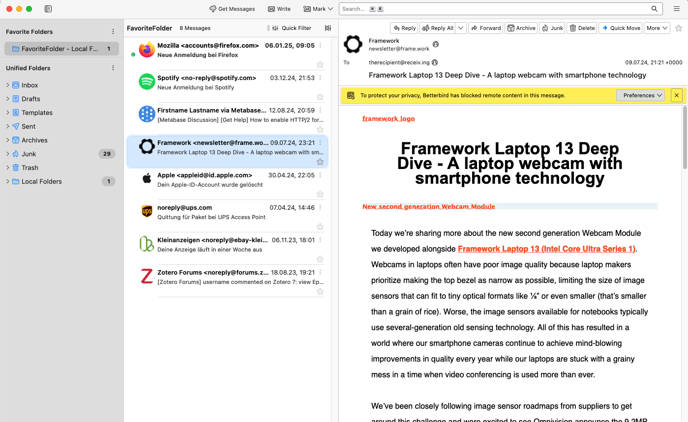

# thunderbird-userchrome

This userchrome for Thunderbird / Betterbird makes the appearance of the e-mail part a bit more mac style like and thus should facilitate switching to Betterbird/Thunderbird.
Now integrated to hide Email Account Folders from unified folders [previously via Addon](https://addons.thunderbird.net/en-US/thunderbird/addon/hide-email-folders).

Example view:

In order to get to this appearance:

* Use the supplied userchrome.css
  * See <https://kb.mozillazine.org/UserChrome.css> for details on how to use it.
* Use these addons:
  * [Auto Profile Picture](https://addons.thunderbird.net/en-GB/thunderbird/addon/auto-profile-picture/)
  * optionally [Quick Folder Move](https://addons.thunderbird.net/en-US/thunderbird/addon/quick-folder-move)
    * Although the extension does not provide a one-click solution as mail.app does, it comes quite close.
* Set these options
  * [x] Hide system window titlebar
  * [x] Auto hide tab bar
  * [x] Display attachment list above message

Thanks for a lot of css snippets from various sources!
